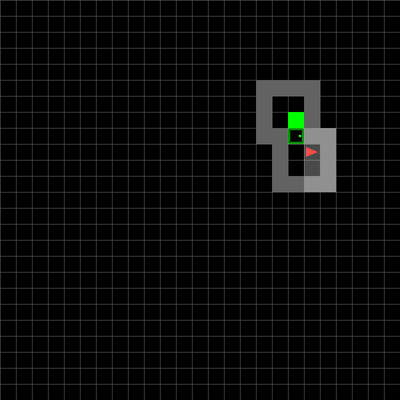
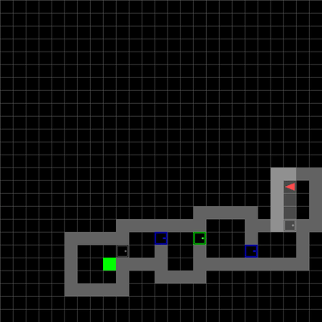
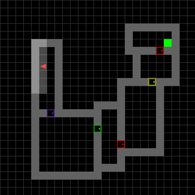
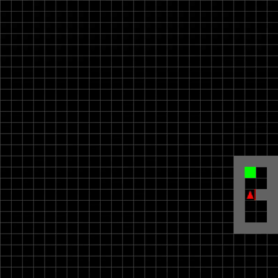
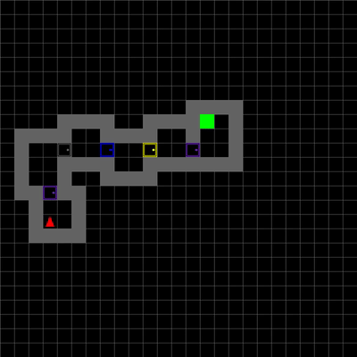
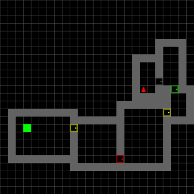
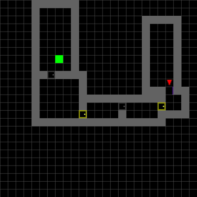

# Deep Reinforcement Learning for MiniGrid MultiRoom Navigation

**Final Project — Deep Reinforcement Learning**
*Reichman University (RUNI), 2025*

Solving the [MiniGrid MultiRoom](https://minigrid.farama.org/environments/minigrid/MultiRoomEnv/) navigation task across 3 environments of increasing complexity using **Proximal Policy Optimization (PPO)** and **Dueling Double DQN (D3QN)** with curriculum learning.

**Authors:** Efi Pecani & Adi Zur

---

## The Agent in Action

### PPO Agent (Curriculum-Trained)

<table>
  <tr>
    <td align="center"><b>Small (2 Rooms)</b></td>
    <td align="center"><b>Medium (4 Rooms)</b></td>
    <td align="center"><b>Large (6 Rooms)</b></td>
  </tr>
  <tr>
    <td align="center"></td>
    <td align="center"></td>
    <td align="center"></td>
  </tr>
  <tr>
    <td align="center">98% success, ~14.5 steps</td>
    <td align="center">~95% success, ~45 steps</td>
    <td align="center">99% success, ~94.7 steps</td>
  </tr>
</table>

### D3QN Agent

<table>
  <tr>
    <td align="center"><b>Small (2 Rooms)</b></td>
    <td align="center"><b>Medium (4 Rooms)</b></td>
    <td align="center"><b>Large (6 Rooms)</b></td>
    <td align="center"><b>Large (Fail Case)</b></td>
  </tr>
  <tr>
    <td align="center"></td>
    <td align="center"></td>
    <td align="center"></td>
    <td align="center"></td>
  </tr>
  <tr>
    <td align="center">100% success, 7.3 steps</td>
    <td align="center">100% success, 33.8 steps</td>
    <td align="center">90% success, 59.5 steps</td>
    <td align="center">Agent gets stuck</td>
  </tr>
</table>

---

## The Challenge

The [MiniGrid MultiRoom](https://minigrid.farama.org/environments/minigrid/MultiRoomEnv/) environment presents a navigation puzzle where an agent must find its way through a series of connected rooms to reach a green goal square. Key challenges:

- **Partial observability** — the agent sees only a small 7x7 grid in front of it, not the full map
- **Randomly generated layouts** — room positions and door locations change every episode
- **Sparse rewards** — the default environment only rewards reaching the goal, nothing else
- **Increasing complexity** — from 2 small rooms to 6 large rooms with long corridors

We solved three environments with increasing difficulty:

| Environment | Rooms | Grid Size | Complexity |
|------------|-------|-----------|------------|
| `MiniGrid-MultiRoom-N2-S4-v0` | 2 | Small (4x4 rooms) | Easy |
| `MiniGrid-MultiRoom-N4-S5-v0` | 4 | Medium (5x5 rooms) | Medium |
| `MiniGrid-MultiRoom-N6-v0` | 6 | Large (variable) | Hard |

---

## Algorithms

### PPO (Proximal Policy Optimization)

An on-policy actor-critic method with clipped surrogate objective to prevent destructively large policy updates.

```
Input (3, 56, 56) RGB
  -> Conv2D(32, 3x3) -> ReLU
  -> Conv2D(64, 3x3) -> ReLU
  -> Conv2D(64, 3x3) -> ReLU
  -> Flatten -> FC(256) -> ReLU -> FC(128) -> ReLU
  -> [Actor head: FC(n_actions)]    # Policy
  -> [Critic head: FC(1)]           # Value
```

**Key features:**
- Curriculum learning: small -> medium -> large (knowledge transfer between stages)
- Entropy regularization: 0.05 -> 0.1 -> 0.15 (increasing with env complexity)
- Learning rate annealing: 2e-4 -> 1e-4 -> 5e-5
- Smart reward wrapper tracking visited rooms to prevent door-cycling exploits

### D3QN (Dueling Double DQN)

An off-policy value-based method combining Double Q-learning (reduces overestimation) with Dueling architecture (separates state value from action advantages).

```
Input (1, 14, 14) Green channel only
  -> Conv2D(32, 3x3) -> ReLU
  -> Conv2D(64, 3x3) -> ReLU
  -> Conv2D(128, 3x3) -> ReLU
  -> Flatten
  -> [Value stream:     FC(256) -> ReLU -> FC(1)]
  -> [Advantage stream: FC(256) -> ReLU -> FC(n_actions)]
  -> Q = V + (A - mean(A))
```

**Key features:**
- Green channel extraction (target is green) + downsampling to 14x14
- Epsilon-greedy with slow decay (0.99995) for sustained exploration
- Experience replay buffer (10K transitions)
- Target network updates every 1K-10K steps

---

## Results

### Performance Comparison

| Metric | PPO | D3QN |
|--------|-----|------|
| **Small env success** | 98% | 100% |
| **Medium env success** | ~95% | 100% |
| **Large env success** | **99%** | 90% |
| **Small env episodes to solve** | **~6,700** | 60,000 |
| **Medium env episodes to solve** | **~5,000** | 80,000 |
| **Large env episodes to solve** | **~5,500** | 90,000 |
| **Small env avg steps** | 14.5 | **7.3** |
| **Large env avg steps** | 94.7 | **59.5** |

**Key takeaways:**
- **PPO is vastly more sample-efficient** — 10-15x fewer episodes to converge
- **D3QN finds shorter paths** in smaller environments (7.3 vs 14.5 steps)
- **PPO scales better** to the hardest environment (99% vs 90% success in 6-room)
- Both algorithms required **custom reward shaping** — default sparse rewards were insufficient

### Reward Shaping

Both algorithms needed carefully designed reward signals to learn effectively:

| Signal | D3QN Reward | PPO Reward |
|--------|------------|------------|
| Exploring new area | +0.05 | — |
| Opening new door | +0.5 | +5.0 |
| Moving through door | +0.2 | — |
| Reaching goal | +1 / +2 / +3 | +15.0 |
| Step penalty | — | -0.001 |
| Unnecessary door open | -0.3 | — |
| Repeated toggling | -0.2 | — |
| Action repetition | -0.1 | — |

---

## Notebooks

All notebooks are in the [`notebooks/`](notebooks/) directory and also available on Google Colab:

### D3QN
- [Training Notebook](notebooks/d3qn_training.ipynb) (69 cells) — full training pipeline with curriculum learning | [Open in Colab](https://colab.research.google.com/drive/1m7cMuRKdBdjyfbn0mUKJNPfCjY97uUxQ?usp=sharing)
- [Evaluation Notebook](notebooks/d3qn_evaluation.ipynb) — load trained models and evaluate | [Open in Colab](https://colab.research.google.com/drive/1I1i_TQXymzBkZ0H4LUANdnT_FOZMC0j6?usp=sharing)

### PPO
- Training Notebook — [Open in Colab](https://colab.research.google.com/drive/1rNRP1w-F70boZwTJLeC5jnsFUz-UBtYO?usp=sharing)
- [Evaluation Notebook](notebooks/ppo_evaluation.ipynb) — load trained models and evaluate | [Open in Colab](https://colab.research.google.com/drive/1xaXOvx-seGtIECX2R92oCwK5Az7tS7sO?usp=sharing)

### Running the D3QN Evaluation

1. Upload the trained model files to the Colab `/content/` folder:
   - `train_2SmallRooms_60000.pkl`
   - `train_6SmallRooms_80000.pkl`
   - `train_6Rooms_90000.pkl`
2. Run all cells

### Running the PPO Evaluation

1. Update model weight paths in the notebook:
   ```python
   model_paths = {
       "small": "/path/to/ppo_agent_small_room.pt",
       "medium": "/path/to/ppo_agent_medium_room.pt",
       "large": "/path/to/ppo_agent_large_room.pt"
   }
   ```
2. Run all cells

---

## Repository Structure

```
├── notebooks/
│   ├── d3qn_training.ipynb         # D3QN full training pipeline (69 cells)
│   ├── d3qn_evaluation.ipynb       # D3QN model evaluation
│   └── ppo_evaluation.ipynb        # PPO model evaluation
├── assets/                         # GIFs for README
│   ├── small_env.gif               # PPO solving 2-room env
│   ├── medium_env.gif              # PPO solving 4-room env
│   ├── large_env.gif               # PPO solving 6-room env
│   ├── d3qn_small.gif              # D3QN solving 2-room env
│   ├── d3qn_medium.gif             # D3QN solving 4-room env
│   ├── d3qn_large.gif              # D3QN solving 6-room env
│   └── d3qn_large_fail.gif         # D3QN failure case in 6-room
├── report.docx                     # Full project report
├── RL_Final_Notebooks.txt          # Colab notebook links
└── README.md
```

## Tech Stack

- **Environment:** [MiniGrid](https://minigrid.farama.org/) (Farama Foundation)
- **Framework:** PyTorch
- **Training:** Google Colab (GPU)
- **PPO:** Custom implementation with curriculum learning + entropy regularization
- **D3QN:** Custom implementation with experience replay + dueling architecture

## License

Academic project — Reichman University, 2025.
